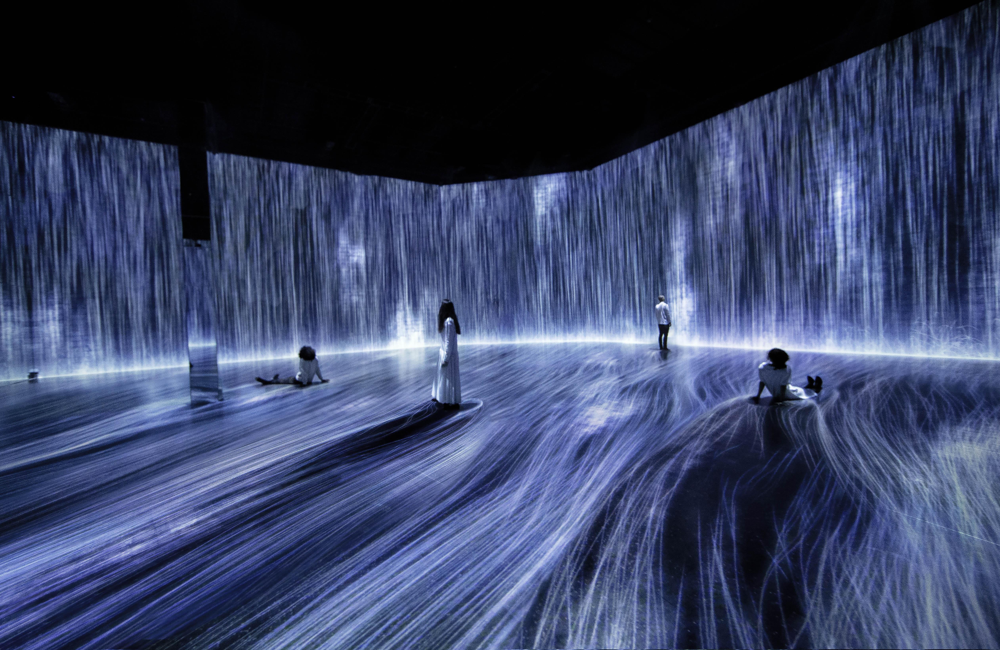
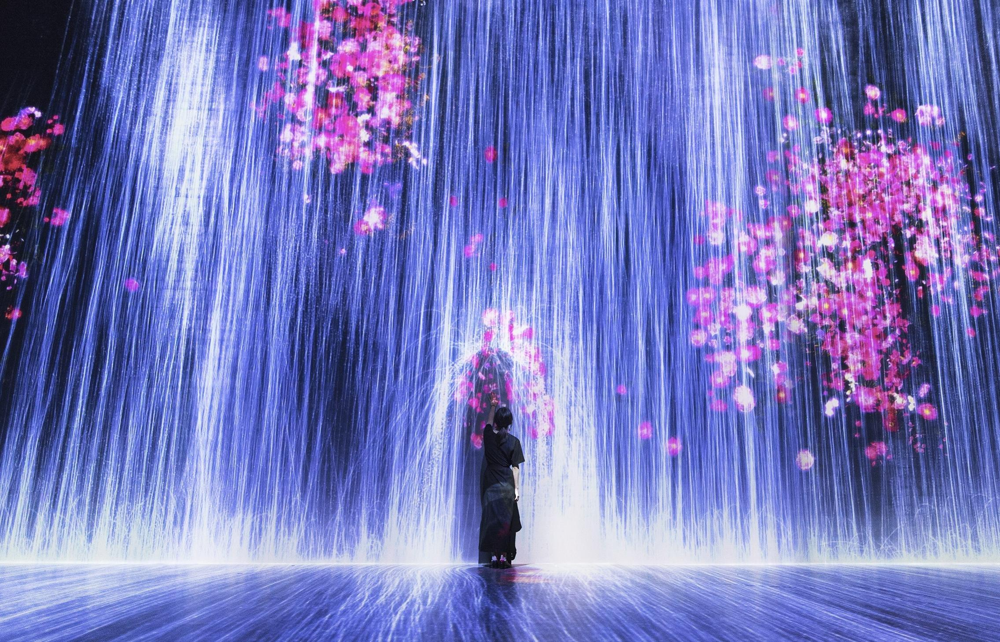
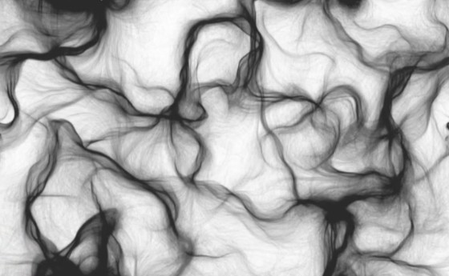

# Quiz 8: Imaging Technique Inspiration and Coding Technique Exploration

## Part 1: Imaging Technique Inspiration

### Chosen Example  
**teamLab — *Universe of Water Particles, Transcending Boundaries***  

Source:  
https://www.teamlab.art/w/waterparticles-transcending/

### Reference Images

  
*Image source: teamLab, Universe of Water Particles, Transcending Boundaries*

  
*Image source: teamLab, Universe of Water Particles, Transcending Boundaries*

### Discussion  
I chose teamLab’s *Universe of Water Particles, Transcending Boundaries* as my imaging technique inspiration. I am interested in how the artwork represents water through many luminous particle-lines instead of realistic video. The image feels fluid, immersive, and alive because the lines respond to people’s presence and continuously change. I would like to incorporate this technique into my project to create a visual experience that feels dynamic rather than static. This is beneficial for the assignment because it shows how digital imaging can express movement, atmosphere, and interaction, not just display information.

---

## Part 2: Coding Technique Exploration

### Coding Technique  
**p5.js Perlin Noise Flow Field**

Example implementation:  
https://thecodingtrain.com/challenges/24-perlin-noise-flow-field/

Example code:  
https://github.com/Abar23/Perlin-Noise-Flow-Field

### Coding Technique Screenshot

  
*Image source: The Coding Train / p5.js Perlin Noise Flow Field example*

### Discussion  
A useful coding technique for achieving this effect is a Perlin Noise Flow Field in p5.js. This technique creates an invisible field of directional forces, and particles move by following those forces. As the particles travel, they leave curved trails that can look like water, wind, smoke, or energy flow. This could help recreate the feeling of teamLab’s particle-based waterfall in a simpler way. By changing speed, opacity, colour, and particle density, the code could produce an animated image that feels organic, soft, and responsive.